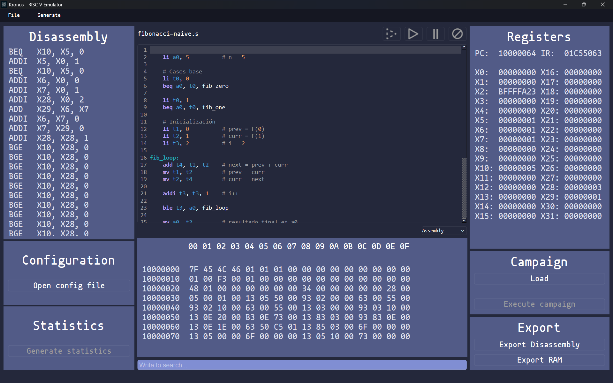
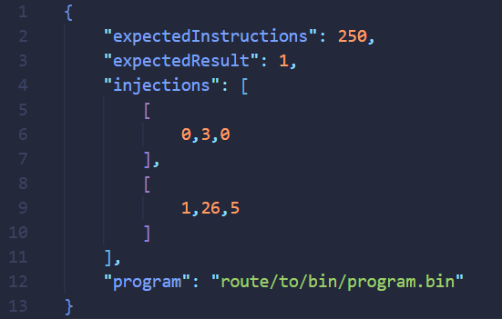
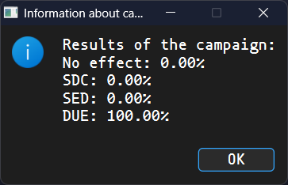

# "Kronos" a RISC-V Emulator

## 1. What is Kronos?
Kronos is an open-source emulator of a RISC-V CPU. It is continuosly updated to satisfy every need that a developer could have. 
### 1.1. What is already developed?
Right know it supports unpriviledge RV32I at its full, but work is being done in order to bring the rest of the most used extensions.

The emulator includes a well designed GUI with the following features:
- A code editor with syntax highlighting for C and Assembly.
- RAM viewer in real time.
- Register viewer in real time.
- Campaign execution (see section [3.2. Error injections](#3.2.-error-injections) for more information about this).
- Disassembly of the executed instructions in real time.
- Support for exporting disassembly and RAM current status.
- Program execution statistics (cycles executed, number of each kind of instruction executed...).
- Configurable RAM size.



And some basic emulation actions like start/stop, step execution, pause and reset.

Additionally, there are some parameters that are configurable, like the RAM size, the export routes, the font family for the code editor... This configurable behaviours are specified in a JSON file on the root folder.

### 1.2. What's the future plan?
I want to include support for 64-bit architecture, but work around that achievement will be done after the RV32 full implmementation.


## 2. Instalation
Install the "Qt Creator" and use it to compile the project. Also you can use CMake with the libraries installed to compile it from source too.
### 2.1. Dependencies
As this emulator supports code editting with syntax highlight of C and Assembly, you must have installed CLang in order to compile code directly. 

Go to [LLVM Official Webpage](https://llvm.org/builds/) and download from there the windows installer.

Make sure you have risc-v available as a target
```
clang --print-targets | Select-String risc
```
You should have 2: riscv32 and riscv64. This emulator currently supports riscv32.


## 3. Documentation
### 3.1. General overview
In first place, this application features a top navigation menu with the following options:
- Archivo: Allows uploading a program, a campaign or close the application.
- Generar: Allows generating a campaign for an specific program.

The emulator has several panels to perform different actions. Additionally, there are 4 buttons on top of the terminal (black canvas):
- Stop button: Stops the execution and resets the emulator.
- Pause button: Stops the execution without resetting the emulator.
- Execute button: Executes the program loaded in memory.
- Step-by-step execution button: Execute 1 clock cycle.

In addition, below the RAM canvas, there is a search box that allows you to look up to a specific memory location. The search format is in hexadecimal without specifying "0x":
- Correct: 80003020
- Incorrect: 0x80003020

### 3.2. Error injections
The main difference from other solutions is the possibility of simulating random errors. RISC-V is being more and more used, and has been extrapolated to another industries. That's the reason why stability is beggining to be more and more crucial too. 

Computers are prone to unpredictable errors casued by, for example, radiation particles. If one high charged particle crosses a memory section, it may flip the bits around, which can cause unknown behaviours (you can do some research about that in the internet. It's quite interesting). 

This emulator provides a tool to check the sturdiness of you program versus this unexpected phenomenom.

#### 3.2.1. How it works
The campaigns are specified in a JSON file with 3 keys:
- Expected instructions: This are the expected instructions the program should perform
- Expected result: This is the expected result a program should return (it should be a value inside a RAM location. This location is specified in config.json file).
- injections: This is an array of 3 values: First one is the number of the instruction the injection will be executed; second one is the register modified; third one is the bit it will flip of that register.



For instance, lets say the values are: 15, 2, 3. The register 2 has 1111 0000 1111 0000 (16 bit to see it better). In the instruction number 15, the change will be performed, so register 2 will be: 1111 0000 1111 1000. 

> [!IMPORTANT]
> One injection per execution. If the JSON file has 200 injections, it will perform 200 executions. 

When the campaign execution is finished, an information box will be displayed showing the effects of the campaign on the program execution with 4 possible effects:
- No effect: The program run as expected.
- SDC (Silent Data Corruption): The program executes expected number of instructions, but the result doens't match the exepected result.
- SED (Single Event Delay): The program result is accurate, but the execution took longer than expected (more instructions has been executed).
- DUE (Detected Unrecoverably Error): The execution has performed more than twice the expected instructions, which is considered as lost.



## 4. Author
- [@ikeruco29](https://www.github.com/ikeruco29)